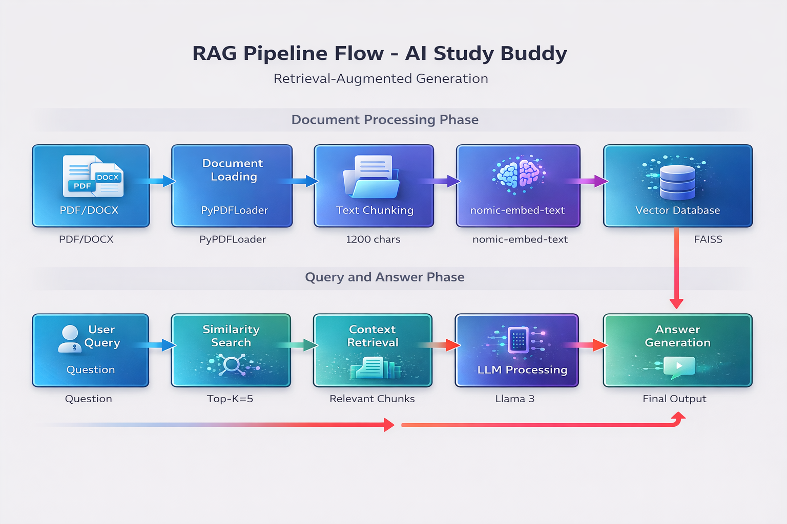

# 📚 Study Buddy - AI-Powered Study Assistant

An intelligent study assistant that helps students learn from their documents using local AI technology. Study Buddy provides smart Q&A, flashcard generation, and summarization features powered by Retrieval-Augmented Generation (RAG).


---

## 📋 Problem Statement

Students face significant challenges when studying complex technical subjects:

- **Cognitive Overload**: Processing lengthy textbooks and dense technical notes is overwhelming
- **Generic Search Results**: Standard search engines provide irrelevant or too-general answers
- **Limited Practice Tools**: Generating practice questions and flashcards independently is time-consuming
- **Exam Preparation**: Preparing for exams with limited time requires efficient study tools
- **Lack of Personalization**: One-size-fits-all learning doesn't address individual needs

### The Solution

Study Buddy addresses these challenges by allowing students to upload their own study materials (PDF/DOCX) and interact with them through an intelligent AI interface that provides:
- Contextual accuracy based on uploaded notes
- Simplified explanations of complex concepts
- Automated flashcard and quiz generation
- Concise summaries for quick revision

---

## ✨ Features

| Feature | Description |
|---------|-------------|
| **📄 Document Upload** | Support for PDF and DOCX files up to 200MB |
| **💬 Smart Q&A** | Ask questions and get mark-based formatted answers (1-7 marks) |
| **🎯 Flashcards** | Auto-generate interactive flashcards from study material |
| **📝 Summarization** | Get concise summaries with adjustable word count |
| **🛡️ Anti-Hallucination** | FAISS similarity threshold prevents irrelevant answers |
| **🔒 Privacy-First** | All processing happens locally - no data leaves your machine |

---

## 🏗️ Project Architecture

```
┌─────────────────┐     ┌──────────────────┐     ┌─────────────────┐
│   User Input    │────▶│  Streamlit UI    │────▶│  Core Logic     │
│  (PDF/DOCX)     │     │  (app.py)        │     │ (core_logic.py) │
└─────────────────┘     └──────────────────┘     └─────────────────┘
                                                        │
                                                        ▼
                                               ┌─────────────────┐
                                               │  FAISS Vector   │
                                               │  Database       │
                                               └─────────────────┘
                                                        │
                                                        ▼
                                               ┌─────────────────┐
                                               │  Ollama (LLM)   │
                                               │  Llama 3        │
                                               └─────────────────┘
```

---

## 🛠️ Tech Stack

| Component | Technology | Purpose |
|-----------|------------|---------|
| **Frontend** | Streamlit | Web UI Framework |
| **LLM** | Ollama (Llama 3) | Local AI Model |
| **Embeddings** | nomic-embed-text | Text Vectorization |
| **Vector DB** | FAISS | Similarity Search |
| **Framework** | LangChain | LLM Orchestration |
| **Monitoring** | LangSmith | Tracing & Debugging |

---

## 📦 Installation

### Prerequisites

1. **Python 3.10+** installed
2. **Ollama** installed on your machine

### Step 1: Clone the Repository

```bash
git clone https://github.com/yourusername/study-buddy.git
cd study-buddy
```

### Step 2: Install Ollama and Pull Models

```bash
# Install Ollama from https://ollama.ai

# Pull the required models
ollama pull llama3
ollama pull nomic-embed-text
```

### Step 3: Install Python Dependencies

```bash
pip install -r requirements.txt
```

### Step 4: Configure Environment Variables

```bash
# Copy the example environment file
cp .env.example .env

# Edit .env and add your LangSmith API key (optional)
# LANGCHAIN_API_KEY=your_api_key_here
```

---

## 🚀 Usage

### Starting the Application

1. **Start Ollama** (in background):
   ```bash
   ollama serve
   ```

2. **Run the Streamlit app**:
   ```bash
   streamlit run app.py
   ```

3. **Open your browser** at `http://localhost:8501`

### How to Use

1. **Upload a Document**: Use the sidebar to upload a PDF or DOCX file
2. **Index the Document**: Click "Index Document" to process and embed your content
3. **Choose a Feature**:
   - **Ask Questions**: Enter questions with optional marks (e.g., "What is TCP/IP? 7 marks")
   - **Generate Flashcards**: Click to create practice cards
   - **Summarize**: Adjust the slider and click "Summarize"

---

## 📖 Project Flow

### 1. Document Processing Pipeline

```
User Upload → File Validation → Loader Selection → Text Extraction 
    → Chunking (1200 chars, 300 overlap) → Embedding Generation 
    → FAISS Vector Store Creation
```

### 2. Question Answering Flow

```
User Query → Mark Detection → Similarity Search (k=5) 
    → Relevance Check (threshold: 1.1) → Prompt Construction 
    → LLM Generation → Answer Formatting
```

### 3. Flashcard Generation Flow

```
Generate Request → Context Retrieval (k=8) → Flashcard Prompt 
    → LLM Generation → Response Parsing → UI Display
```

### 4. Summarization Flow

```
Word Count Input → Document Retrieval → Length Validation 
    → Summarization Prompt → LLM Generation → Word Count Truncation
```

---

## 📊 Mark-Based Answer System

| Marks | Word Count | Response Type |
|-------|------------|---------------|
| 7 marks | 350-420 words | Detailed essay with examples |
| 4 marks | 200 words | Structured bullet points |
| 3 marks | 150 words | Concise with key points |
| 2 marks | 80-100 words | Short explanation |
| 1 mark | 30 words | One-liner answer |

---

## 🔐 Privacy & Security

- **Local Processing**: All document processing occurs locally on your machine
- **No Data Retention**: Documents are not stored after the session ends
- **User Responsibility**: Ensure you have rights to upload processed documents
- **AI Attribution**: Verify AI-generated content before academic submission

---

## 📁 Project Structure

```
study_buddy/
├── app.py                 # Streamlit web application
├── core_logic.py          # RAG pipeline and AI logic
├── requirements.txt       # Python dependencies
├── README.md              # Project documentation
├── PROJECT_FLOW.md        # Technical flow guide
├── .env.example           # Environment variables template
└── .gitignore            # Git ignore rules
```

---

## 🧩 Troubleshooting

| Issue | Solution |
|-------|----------|
| Ollama not running | Run `ollama serve` in terminal |
| Model not found | Pull models: `ollama pull llama3` |
| Out of memory | Close other applications |
| File too large | Reduce file size below 200MB |
| Slow responses | Reduce k value in similarity search |

---

## 🤝 Contributing

1. Fork the repository
2. Create your feature branch (`git checkout -b feature/AmazingFeature`)
3. Commit your changes (`git commit -m 'Add some AmazingFeature'`)
4. Push to the branch (`git push origin feature/AmazingFeature`)
5. Open a Pull Request

---

## 📄 License

This project is licensed under the MIT License - see the LICENSE file for details.

---

## 🙏 Acknowledgments

- [LangChain](https://python.langchain.com/) for LLM orchestration
- [Ollama](https://ollama.ai/) for local LLM deployment
- [FAISS](https://faiss.ai/) for similarity search
- [Streamlit](https://streamlit.io/) for the web UI

---

**Made with ❤️ for students, by students**


